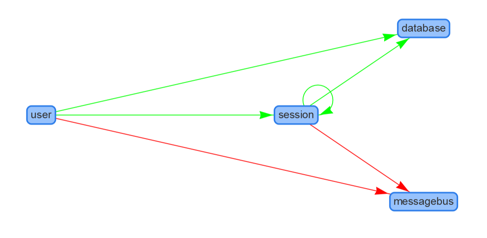

# Voltmeter

A graphical overview of system health status.

Build status: 
[](https://ci.appveyor.com/project/sandermvanvliet/voltmeter)

This application was built to quickly visualise the current state of services in any particular environment.
It leverages [simple service status endpoints](https://github.com/beamly/SE4/blob/master/SE4.md) (SE4) as defined by Beamly to provide this information.

Depending on how you can discover environments and services, the overview will be updated automatically when services
appear or disappear in your running landscape.

Currently this has a hard coded set of providers that will just generate services and dependencies that can be
used as a demonstration version of Voltmeter. To actually to make this work you will need to impement the
ports you will need to make it work for your use case.

## Running with the SE4 adapter

Do demonstrate how Voltmeter works it comes with an adapter that supports retrieving status from
services that support the [simple service status endpoints](https://github.com/beamly/SE4/blob/master/SE4.md). Discovery
is handled through the configuration file `appsettings.<environment>.json`. 
Configuration looks like so:

```json
{
    "Voltmeter": {
        "Environments": [ "prod", "qa", "test" ],
        "Services": [
            {
                "Name": "user",
                "LocationPattern": "https://user.{environment}.tempuri.org"
            },
            {
                "Name": "session",
                "LocationPattern": "https://sessions.{environment}.tempuri.org"
            }
        ]
    }
}
```

* `Environments` is a list containing the names of the environments.
* `Services` is a list of known services
  * `Name` is the name of the service
  * `LocationPattern` is the URI of the service, `{environment}` will be replaced with values from `Environments`

When you run the application you should see a diagram similar to the one below:



You'll note the `database` and `messagebus` nodes in the diagram which are not in the configuration. 
Voltmeter will automatically add nodes to the diagram that it finds in the service dependencies and
don't yet exist as known services.

## Making this your own

The Voltmeter UI needs an adapter that must be configured to provide evironments, services and dependencies that
will be used to visualise your landscape.

Start with by adding a new class library to contain the implementation you will created. You will create a
class to register you port implementations to wire up the ports. 

Create a class that you supply a `IServiceCollection` to register the ports. You will need to register the store
as a singleton to share state in the application.

Then the fun part starts, you will need to implement the following ports:

* `IEnvironmentProvider` to discover environments
* `IServiceDiscovery` to discover services in a particular environment
* `IServiceStatusProvider` to get status of the service
* `IServiceDependenciesProvider` to determine the dependencies of a service

## Building

Voltmeter uses [Cake](https://cakebuild.net) to build, test and package. You can run this on both Windows, Linux and macOS.

On Windows:

```PowerShell
> .\build.ps1 -Target Build-Release -Configuration Release
```

On Linux/macOS:

```bash
> ./build.sh --target=Build-Release --configuration=Release
```

Note that on Linux, the `build.sh` script automatically installs dependencies through `apt-get` so YMMV on other Linuxes. 
The dependencies it looks for are: `curl`, `unzip`, `dotnet` and `git`. If you already have them on your system you'll be fine.

You can also run the build inside a docker container if you want. In that case do:

```bash
> docker run --rm -it -v c:\git\Voltmeter:/tmp/repo -w "/tmp/repo" ubuntu:18.04 ./build.sh --target=Build-Release --configuration=Release
```
This will create a binary release of Voltmeter in `/artifacts`

## Models

| Model | Purpose |
|-------|---------|
| Environment | Contains a set of services particular for that environment |
| Service | A logical service, specific to a particular `environment` |
| ServiceStatus | The state of a `service` in an `environment` |
| Dependency | The name of a dependency of a `service` |
| DependencyStatus | The state of a `dependency` of a `service` |

